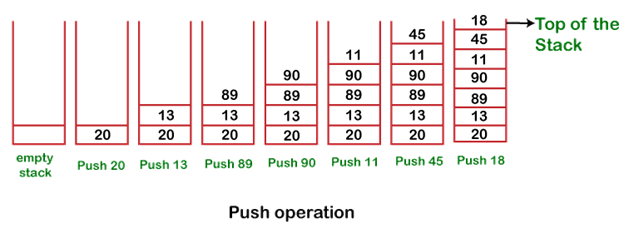

# The stack is a linear data structure that is used to store the collection of objects. It is based on Last-In-First-Out (LIFO). Java collection framework provides many interfaces and classes to store the collection of objects.

